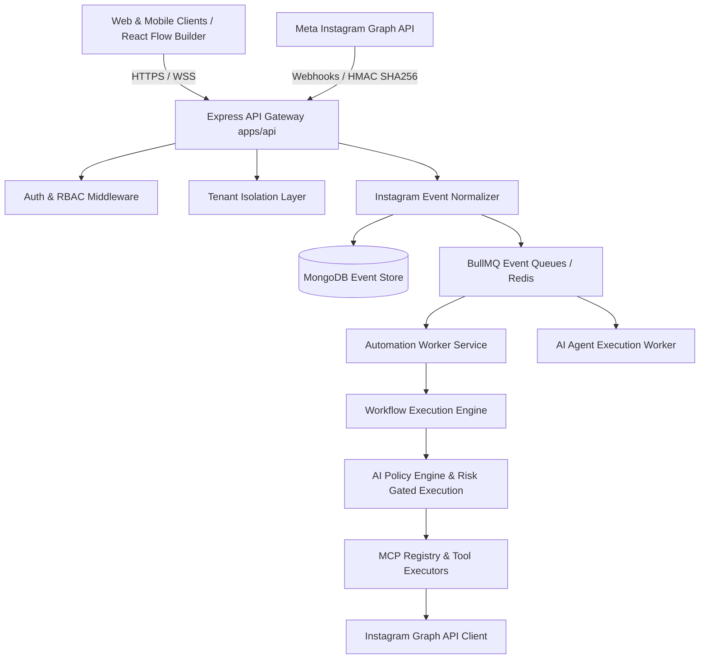
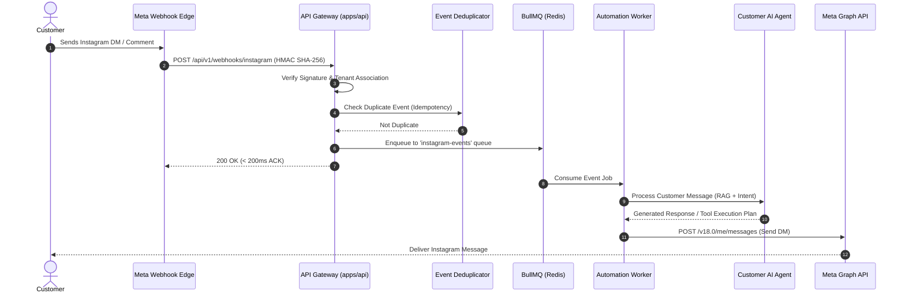
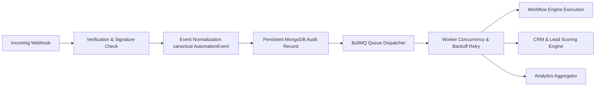
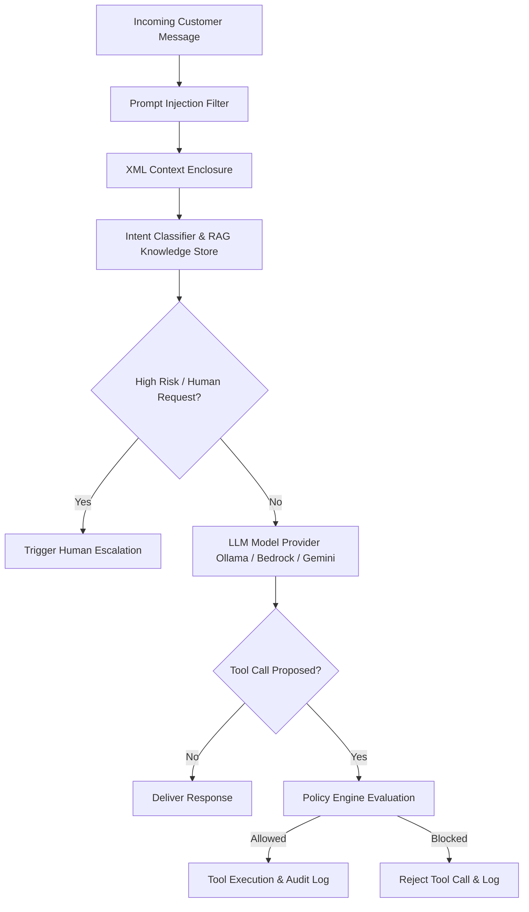
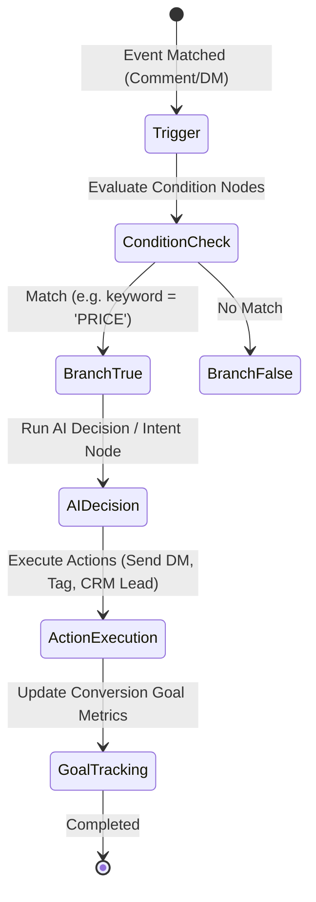
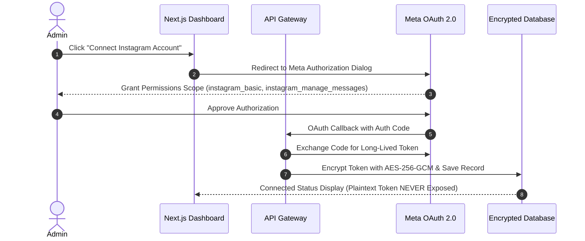
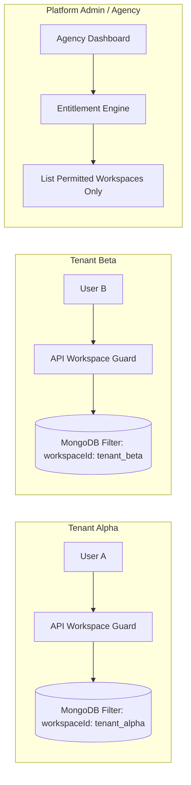
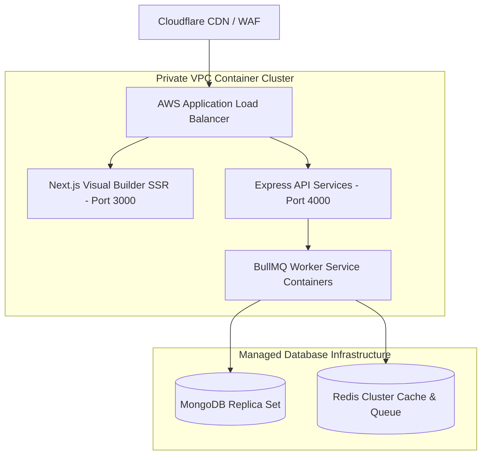
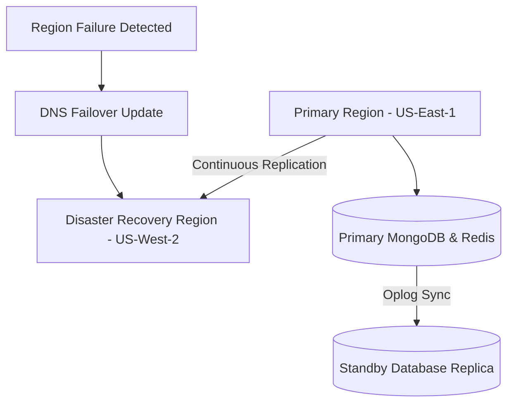

# Instagram Automation OS - Final System Architecture

## Executive Architecture Summary
Instagram Automation OS is an enterprise-grade social automation engine designed to support high-volume Instagram direct messaging, lead capture, visual workflow execution, customer-facing AI agents, and multi-tenant SaaS management.

---

## 1. System Components & Architecture Overview



---

## 2. Request Flow Architecture



---

## 3. Event Flow Architecture



---

## 4. AI Agent Architecture Flow



---

## 5. Workflow Execution Engine Flow



---

## 6. Instagram Integration Flow



---

## 7. Tenant Isolation Model



---

## 8. Deployment Architecture



---

## 9. Disaster Recovery Strategy



---

## 10. Scaling Strategy

```mermaid
flowchart LR
    Load[100,000 DMs / Min Load] --> Gateway[API Gateway Rate Limiter]
    Gateway --> PubSub[Redis Pub/Sub & BullMQ Partitioning]
    PubSub --> WorkerScale[Auto-Scaling Worker Pods (HPA 1-50 Pods)]
    WorkerScale --> DBWrite[MongoDB Write Sharding & Redis Caching]
```
